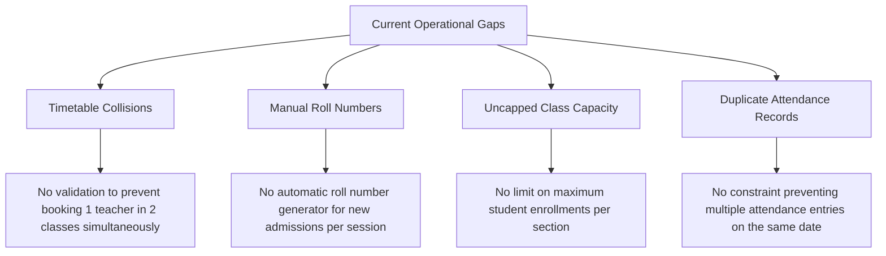
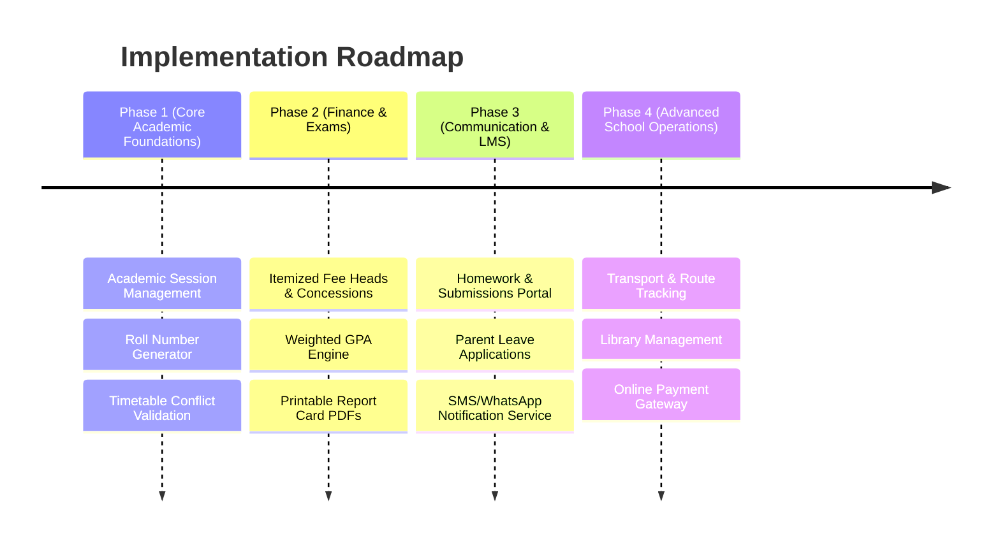

# School Automation System - Comprehensive Gap Analysis & Missing Scenarios

## 1. System Audit: Currently Implemented Features

| Module | Implemented Scope | Current Limitation |
| :--- | :--- | :--- |
| **Authentication & Users** | Admin, Teacher, Student, Parent roles; JWT tokens, Cookie/Header auth, Password reset | Basic role definitions; no custom granular sub-permissions. |
| **Organization Management** | Multi-tenant organization creation & user affiliation | Single-branch focus; no multi-campus central dashboard. |
| **Student Management** | Standard student profile (Name, Roll No, Class, Section) | No academic session history, graduation status, or document storage. |
| **Teacher Management** | Profile details, assigned classes, and subject tags | No work schedules, qualification certificates, or leave balances. |
| **Parent Management** | CNIC, phone, occupation, student mapping via `StudentParent` | Single primary contact focus; limited emergency contact details. |
| **Class Management** | Grade level, section, class teacher assignment | Lacks section capacity limits and subject-teacher mapping matrices. |
| **Attendance** | Daily attendance recording (Present, Absent, Late, Leave) | No leave approval workflows, gate punch-in, or parent notification dispatch. |
| **Fee Management** | Single flat fee generation (Amount, Due Date, Paid/Unpaid) | Lacks breakdown into fee heads, concessions, installments, or payment gateway integration. |
| **Results & Marks** | Marks entry per subject, single subject grade calculation | No weighted GPA aggregation, class ranks, term report cards, or transcript generation. |
| **Timetable** | Daily schedule entry by periods | No conflict resolution logic (teacher double-booking or room collision checks). |
| **Academic Warnings** | Issue and store warning records for students | Manual log only; not linked to automatic performance triggers. |
| **Approval Workflows** | Multi-step approval request pipeline | Generic model; not wired into leave or clearance processes. |

---

## 2. Comprehensive Breakdown of Missing School Scenarios

### Module 1: Academic Lifecycle & Session Management (Critical)
- **Academic Year / Session Scope**:
  - Ability to create and switch academic sessions (e.g., `2024-2025`, `2025-2026`).
  - Historical data scoping: Attendance, fees, marks, and timetables must be tied to a specific academic year.
- **Bulk Student Promotion & Retention Engine**:
  - End-of-year batch promotion: Automatically move passing students from `Grade 9-A` to `Grade 10-A`.
  - Retention/demotion handling for failing students.
- **Alumni & Graduation Archival**:
  - Archiving records of passed-out batches for transcript verification without cluttering active student lists.

---

### Module 2: Examinations, Grading & Transcripts
- **Multi-Assessment Weightage Aggregation**:
  - Weighted grade computation (e.g., `10% Quizzes + 20% Assignments + 30% Midterm + 40% Final Exam = Total Grade`).
- **Customizable Grading Schemes**:
  - Support for GPA scales (e.g., 4.0 GPA), Letter Grades (A+, A, B, C, F), or Custom Percentage Bands based on school policy.
- **Exam Scheduling & Hall Allocation**:
  - Examination date sheet generation, hall capacity allocation, and student Roll-Number/Admit Card generation.
- **Report Card & Transcript PDF Engine**:
  - Automated PDF report card generation with school logo, letterhead, grading key, teacher remarks, and digital signatures.
- **Class Rank & Percentile Calculation**:
  - Auto-computing 1st, 2nd, 3rd position in class/section, percentile, and overall class average.
- **Grace Marks & Re-Evaluation Requests**:
  - Student/parent workflow to request paper re-checking or apply grace mark rules.

---

### Module 3: Learning Management System (LMS) & Homework
- **Daily Homework & Assignments**:
  - Teachers posting daily homework with instructions and attachments (PDF, images).
  - Online student submission portal with file uploads and deadlines.
  - Teacher grading and feedback comments on submitted assignments.
- **Syllabus Progress Tracking**:
  - Breakdown of course syllabus into chapters and monitoring completion percentage prior to exams.
- **Digital Study Material Repository**:
  - Centralized subject-wise digital library for lecture slides, notes, and reference links.

---

### Module 4: Finance, Accounting & Payroll (Offline Cash/Bank & Fee Voucher PDFs)
- **Itemized Fee Head Breakdown**:
  - Categorized fee structures: `Tuition Fee`, `Transport Fee`, `Lab Fee`, `Sports Fee`, `Admission Fee`, `Exam Fee`, `Annual Charges`.
- **Concessions, Discounts & Scholarships**:
  - Sibling discount logic (e.g., 50% discount for 2nd child).
  - Need-based financial aid, merit scholarships, and staff child concessions.
- **Student Fee Voucher & Payment Receipt PDF Generation**:
  - Printable/downloadable official Fee Voucher and Payment Receipt PDFs for students and parents (showing itemized breakdown, concessions, net payable, due date, and payment status).
  - Manual Cash / Direct Bank Transfer payment status updates by school accountant (No online payment gateway needed).
- **Staff Payroll & Salary Disbursement**:
  - Salary structure definition (Basic Pay, Allowances, Tax, Provident Fund, Leave Deductions).
  - Payslip PDF generation and monthly salary disbursement logs.
- **School Operating Expense & Budgeting**:
  - Tracking school expenses (Utility bills, maintenance, stationery, vendor invoices) and generating Balance Sheet & Income Statements.

---

### Module 5: Attendance & Leave Management Edge Cases
- **Parent-Initiated Student Leave Requests**:
  - Parent portal to submit sick/casual leave applications with doctor certificate attachments.
  - Teacher/Principal approval dashboard.
- **Biometric / RFID Gate Entry System**:
  - API endpoints for hardware scanners (RFID cards / QR codes) at entry gates.
  - Auto-dispatching SMS/Notification to parents upon student arrival and departure.
- **Staff Attendance & Substitution Management**:
  - Staff leave balance tracking (Casual, Sick, Earned leaves).
  - Automated substitution engine (assigning free teachers to cover absent teachers' periods).

---

### Module 6: Admission, Registration & Clearance Workflows
- **Online Admission Portal**:
  - Prospective parent application portal, admission test scheduling, and merit list publishing.
- **Document Verification Pipeline**:
  - Document checklists (Birth Certificate, B-Form, Transfer Certificate, Vaccination Records).
- **School Leaving Certificate (SLC) & Clearance (No-Dues)**:
  - Multi-department clearance workflow (Accounts clearance, Library book check, Sports gear return, Science lab clearance) before issuing an official SLC.

---

### Module 7: Transport, Library & Asset Operations
- **Transport & Route Management**:
  - Vehicle fleet details, driver records, bus route mapping, pick & drop stops, and student-bus assignments.
  - Real-time GPS bus tracking portal for parents.
- **Library Management System**:
  - Book inventory management (ISBN, Title, Author, Shelf), book issuing/returning, and overdue fines.
- **School Asset & Inventory Management**:
  - Asset tracking (Computers, Projectors, Furniture, Lab Equipment) and purchase requisition forms.

---

### Module 8: Multi-Channel Communication
- **Automated Notifications**:
  - SMS, WhatsApp Business, Email, and Push Notifications for emergency closures, fee reminders, and unexcused absence alerts.
- **School Notice Board & Events Calendar**:
  - Digital circulars, photo galleries, holiday lists, and Parent-Teacher Meeting (PTM) schedules.
- **Parent-Teacher Direct Messaging**:
  - Secure 1-on-1 communication channel between parents and subject teachers.

---

### Module 9: Security, Multi-Campus & Governance
- **Multi-Campus Architecture**:
  - Managing multiple school branches under one umbrella organization with campus-isolated data access.
- **Granular Role-Based Access Control (RBAC)**:
  - Specialized roles: `Accountant`, `Librarian`, `Receptionist`, `Exam Controller`, `Transport Manager`.
- **Immutable Audit Trails**:
  - Logging all sensitive actions (marks changes, fee modifications, user status updates) with timestamp, user ID, and IP address.

---

## 3. Critical Business & Operational Logic Gaps

---

## 4. Recommended Implementation Priority Roadmap

